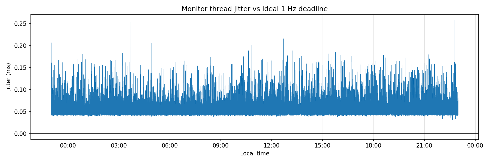
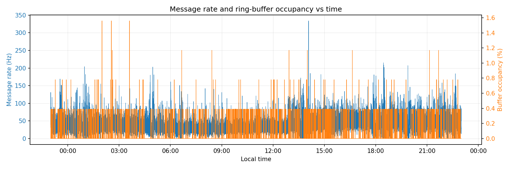
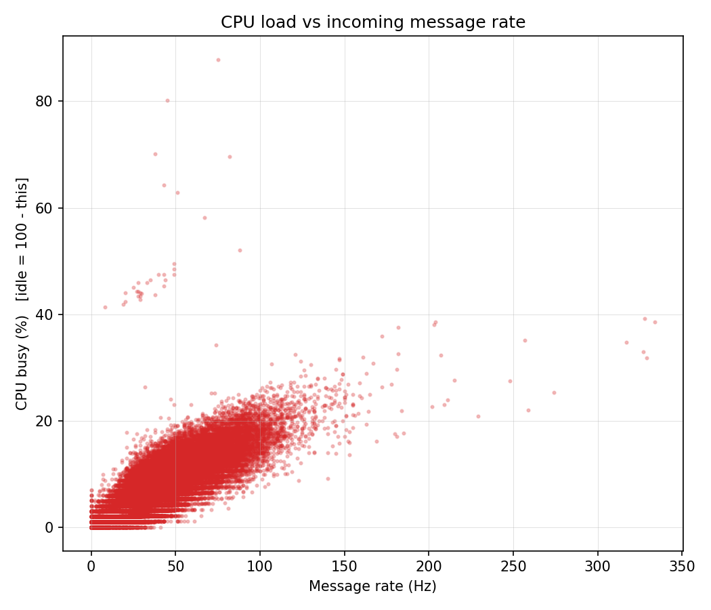

# Jetstream Real-Time Telemetry Logger

Final assignment - Real-Time Embedded Systems

Aristotle University of Thessaloniki

## Overview

Three POSIX threads around the bounded circular buffer from assignment 1,
consuming the Bluesky Jetstream firehose and appending one CSV line per second
to `metrics_log.txt`. One file per thread:

| File | Role |
| --- | --- |
| `producer.c` | **Thread 1** - `libwebsockets` client. Event-driven: every raw JSON frame is timestamped, pushed into the circular buffer, and the callback returns to the network immediately. Also owns the websocket context, so nothing else includes `libwebsockets.h`. |
| `consumer.c` | **Thread 2** - wakes on `notEmpty`, parses with `cJSON` and increments the mutex-protected per-kind counters. No `printf`, no file I/O. Owns `classify()` and the Welford wait-time statistics. |
| `monitor.c` | **Thread 3** - runs strictly every second, fetches upstream data and zeroes the counters, measures buffer occupancy and CPU, appends one line. Owns the `/proc/stat` sampling. |
| `telemetry.c` | `main`: controls signals, counters and thread lifecycle |
| `queue.c` / `queue.h` | Circular buffer, extended from assignment 1. |

### Data format
the results are appended like this on a CSV file every second.
```
Seconds,Nanoseconds,Commit_Count,Identity_Count,Account_Count,Info_Count,Buffer_Occupancy_Pct,CPU_Pct
```

## Requirements

- GCC
- `pthreads` (`-lpthread`), `libm` (`-lm`)
- `libwebsockets` (`-lwebsockets`), `cJSON` (`-lcjson`)

```bash
sudo apt install build-essential libwebsockets-dev libcjson-dev ca-certificates
```

## Build and Use

```bash
make
./telemetry                       # until SIGINT/SIGTERM
./telemetry -o log.txt -d 600    # stop after 600 logged seconds
```

Run as root for `SCHED_FIFO` and `mlockall`; without them it still runs, warns,
and produces identical output with worse jitter.

## Makefile Targets

| Target | Description |
| --- | --- |
| `make` | Compile the binary |
| `make unit` | `classify()` unit tests under ASan/UBSan/LSan (milliseconds) |
| `make test` | 60-second live run, then `check-realtime.py` on the result |
| `make tsan` | Rebuild under ThreadSanitizer to check for races |
| `make clean` | Remove the compiled binary |

## Configuration

| Constant | Where | Default |
| --- | --- | --- |
| `QUEUESIZE` | `queue.h` | 256 slots |
| `SLOTSIZE` | `queue.h` | 16384 B |
| `MONITOR_RT_PRIO` | `telemetry.h` | 50 (`SCHED_FIFO`; 0 disables) |
| `JS_HOST` / `JS_PATH` | `telemetry.h` | Jetstream endpoint |

Jetstream runs at ~50 msg/s, and the consumer turns a frame around in 60-130 us, so the ring is empty almost all the time.

## Real-time design notes

**Absolute deadlines.** `clock_nanosleep(CLOCK_REALTIME, TIMER_ABSTIME, ...)`
against a deadline advanced by `next.tv_sec += 1`, never `now + 1s`. A late
wakeup does not push the following deadline out, so timing error cannot
accumulate: drift is zero by construction over any run length.

**Jitter is already in the log.** The ideal deadline is always a whole second,
so the nanoseconds field is the signed jitter:
`tv_nsec < 5e8 ? tv_nsec/1e6 : (tv_nsec - 1e9)/1e6` milliseconds. That reading
is only valid while `|jitter| < 500 ms`, which is what the overrun guard
protects.

**Overrun guard.** If a deadline has already passed when the monitor reaches it
- a scheduling stall, an NTP step, a suspended process - advancing by another
second would leave it in the past too and the loop would fire back-to-back to
catch up.

**The websocket context is owned by `producer.c`, not shared.** `stream_init()`
runs in `main` before any thread exists and `stream_destroy()` after they are
all joined, so the pointer never changes while another thread can see it.

**Network resilience.** `lws_retry_bo_t` gives exponential backoff
(1/2/4/8/16 s, then 16 s forever) with 20% jitter. `secs_since_valid_ping = 30`
and `secs_since_valid_hangup = 60` detect a TCP connection failure.

## On the Raspberry Pi Zero W

The Zero W uses **ARMv6**, so it needs 32-bit Raspberry Pi OS. It has
no Ethernet, so Wi-Fi and SSH must be baked into the image before first boot
(Raspberry Pi Imager, OS customisation), and its radio is 2.4 GHz only.

```bash
sudo ./scripts/pi-setup.sh        # deps, Wi-Fi power save, chrony, limits
make && make unit                 # ~1-2 min natively on the Zero W

sudo cyclictest -m -t1 -p 50 -i 1000000 -l 600 -q   # hardware jitter floor
make test                                           # then compare
```

Measure the floor first: whatever `cyclictest` reports at the same priority and
period is what the kernel can do, and the program cannot beat it.

| Script | Purpose |
| --- | --- |
| `scripts/pi-setup.sh` | One-time Pi setup, idempotent, needs root |
| `scripts/check-realtime.py` | Jitter/drift/gap report from a log file |
| `scripts/telemetry.service` | Unattended capture unit |

`telemetry.service` uses `Requires=time-sync.target` because the Zero W has no
hardware RTC and the monitor sleeps on absolute `CLOCK_REALTIME` deadlines.

## Before the 24-hour run

```bash
sudo iw wlan0 set power_save off        # #1 cause of overnight dropouts
sudo timedatectl set-timezone Europe/Athens
timedatectl status                      # confirm NTP synchronised
vcgencmd get_throttled                  # 0x0 means no undervoltage
```

## After the 24-hour run

Nothing above stops `telemetry` on a schedule, so a log pulled off the Pi
usually has a few extra minutes before/after the intended 23:00-to-23:00
window (and, if the Pi was restarted mid-project, older unrelated segments
too). This script turns that raw log into the exact 24h file the report
needs:

```bash
./scripts/extract-24h-capture.py results/metrics_log.txt -o results/24_hour_capture.txt
```
Picks the first complete 23:00 cycle found (`--date YYYY-MM-DD` to pick a
different one) and writes just those 86400 rows, unchanged, to the output
file. Refuses to write anything for a cycle that is truncated or has
missing seconds, so a `24_hour_capture.txt` that exists is guaranteed
complete.

## Post-processing plots

```bash
./scripts/plot_metrics.py results/24_hour_capture.txt
```

Three plots, matching the same jitter/gap convention as `check-realtime.py`
(a row that flushed a stall has a meaningless `Nanoseconds`, so it is left
out of the jitter plot only):

**`jitter.png`** - signed offset of the monitor's wakeup from its ideal
whole-second deadline, over the full 24h.



Every sample lands inside +0.03..+0.26 ms, three orders of magnitude under
the 1 s period, with no drift over the 24h (see `accumulated drift` below) -
`SCHED_FIFO` + `PTHREAD_PRIO_INHERIT` + `mlockall` holding the line.

**`load_buffer.png`** - message rate (Hz) and ring-buffer occupancy (%)



**`cpu_load.png`** - CPU busy % vs message rate (idle = 100 minus this).



CPU load rises with message rate, roughly linearly at low-to-moderate rate
and flattening off at the highest rates (parsing gets more efficient in
larger batches per wakeup).